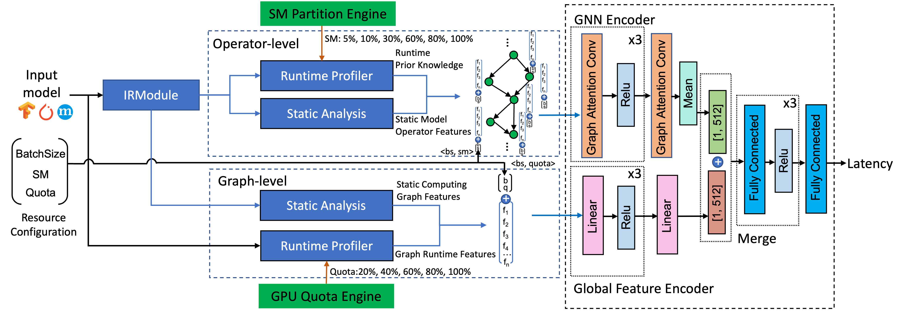
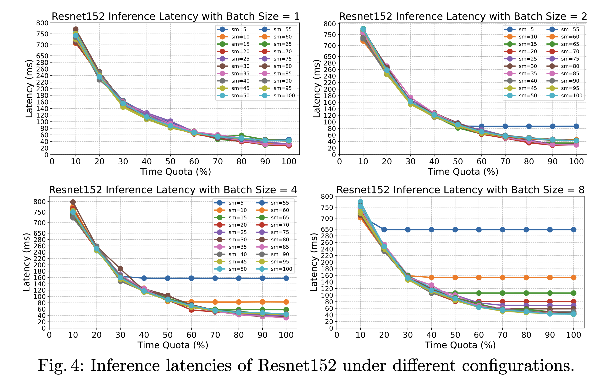
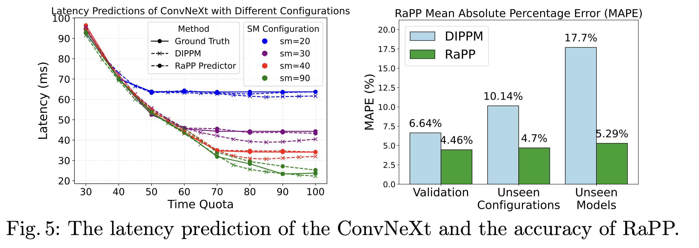

# RaPP: Fine-grained GPU **R**esource-**a**ware **P**erformance **P**rediction for Deep Learning Inference

Fine-grained GPU resource allocation with any granularity introduces massive configuration spaces and performance uncertainty. For example, a deep learning model with 4 batch sizes, 10 quotas, and 10 SM partition configurations brings 400 distinct configuration possibilities and performance outcomes. **Resource-aware Performance Prediction (RaPP)** model is designed to predict inference latency for arbitrary batch sizes under any spatio-temporal GPU resource configurations to resolve inference performance uncertainty introduced by massive resource configuration spaces. It comprises two main components: feature extraction and the GNN-based predictor.

---
### Deployment (QuickStart)

#### Inference Prerequisite (conda)
```
$ pip3 install torch torchvision torchaudio 
$ pip3 install -r requirements.txt
```
#### Inference
Start the inference server:
```
$ cd server
$ python3 server.py
```
Predict deep learning performance under spatio-temporal GPU resource allocation (a new terminal):
```
$ cd client
$ python3 client.py  
```
The script `client.py` takes `model_name`, `batch_size`, `quota`, and `sm` as inputs for the RaPP latency prediction model. The currently supported models are listed in the `./server/model_features_all_models` folder.

---
### Datasets
The dataset contains `53400` data samples (stored in Google Drive [model_dataset.zip](https://drive.google.com/file/d/1I-uFOYz8GKmbzhRm_GotFv1CLB5HRFEG/view?usp=sharing)). `42720` samples as the training set, `5340` samples as the validation set, and `5340` samples as the test set. Please download the dataset and unzip it into the `./data` folder.
```
$ cd data
$ pip install gdown zip
$ gdown https://drive.google.com/uc?id=1I-uFOYz8GKmbzhRm_GotFv1CLB5HRFEG
$ unzip model_dataset.zip
```

The training-related scripts are located in `./train`. To train the RaPP model:
```
$ cd train
$ python3 train.py
```
---
### Result
The experimental results are stored in `./result`. 

#### 1. Model Performance with Fine-grained Resource Allocation
Figure 4 illustrates the inference latency of ResNet-152 under different batch sizes, SM partitions, and quota allocations. The results validate the effectiveness of HAS-GPU’s fine-grained spatio-temporal resource allocation. The result data is stored in the folder `./result/resnet152`.



#### 2. Resource-aware Performance Prediction Analysis
The best-performing model after training is `epoch=183-step=8351760.ckpt`, which corresponds to a validation MAPE (Mean Absolute Percentage Error) of `0.44647` (i.e., the result at epoch 183). For unseen configurations, the corresponding MAPE is `0.47020`, corresponding to the model's performance on the final test set.

To evaluate the model's generalization ability on unseen deep learning applications, we excluded certain models from the training set and retrained the model. Evaluation was then conducted using `only_test.py` under the `./infer` directory, showing the MAPE of `0.052850`. 

The latency results of the ConvNeXt model under different GPU resource configurations (varying SMs and quotas) with a batch size of 4 are stored in `convnext_base_4_predict.txt`. These latency results were obtained by running the `./infer/infer_from_profile_model.py` script.

```
$ python3 infer_from_profile_model.py
```




---

### Model Feature Extraction (For training and pre-extracted before inference)
This section focuses on extracting both static and runtime features of deep learning models at the operator and graph levels. All extracted features are stored in  `./server/model_features_all_models`.

Extract Operator/Graph Static Features --> Extract Operator Runtime Features (Prior Knowledge, SM) --> Extract Graph Runtime Features ((Prior Knowledge, QUOTA)) --> Assemble Features for Graph Nodes
#### Prerequisite (conda)
Install Apache [TVM](https://tvm.apache.org/):
```
$ conda install -c conda-forge libgcc-ng
$ python -m pip install --pre -U -f https://mlc.ai/wheels mlc-ai-nightly-cu123
$ python -c "import tvm; print(tvm.__version__)"
```
Enable NVIDIA MPS (Multi-Process Service):
```
$ sudo nvidia-cuda-mps-control -d  
```

#### Extract features of a single model (eg.)
- Extract operators' static features: (nx32)
```
$ python3 op_static_feature_extractor.py  --model_name resnet50 --input_shape "3,224,224" 
```
- Extract operators' runtime features: (nx6)
```
$  python3 op_runtime_feature_extractor.py  --model_name convnext_base --input_shape "3,224,224"  --sm_partition 100 > test.log 2>&1
```
- Extract graph runtime features: 
```
$ LD_PRELOAD=/home/ubuntu/konton_ws/HAS-FaST-Manager/build/libfast.so.1 python3 graph_runtime_features.py --model_name resnet50 --input_shape "3,224,224" --sm_partition 50 --quota_config_path /home/ubuntu/konton_ws/HAS-FaST-Manager/config/clients_config.txt 
```
- Extract all features except input for a model:  (eg.)
```
python3 model_features.py --model_name alexnet
```

- Add input feature to the model (eg.)
```
python3 assemble_training_item.py 
```

#### Extract features for multiple models 
- Extract operators' static features: (nx32)  `.pkl`
```
python3 op_static_generate.py  
```
- Extract operators' runtime features: (nx6)  --> `json`
```
$ python3 op_runtime_generate.py
```
- Extract operators' graph features:  (10) --> `.pkl`
```
$ python3 model_features_generate.py
```


---
### License
Copyright 2024 FaST-GShare Authors, KontonGu (**Jianfeng Gu**), et. al.
@Techinical University of Munich, **CAPS Cloud Team**

Licensed under the Apache License, Version 2.0 (the "License");
you may not use this file except in compliance with the License.
You may obtain a copy of the License at

    http://www.apache.org/licenses/LICENSE-2.0

Unless required by applicable law or agreed to in writing, software
distributed under the License is distributed on an "AS IS" BASIS,
WITHOUT WARRANTIES OR CONDITIONS OF ANY KIND, either express or implied.
See the License for the specific language governing permissions and
limitations under the License.
